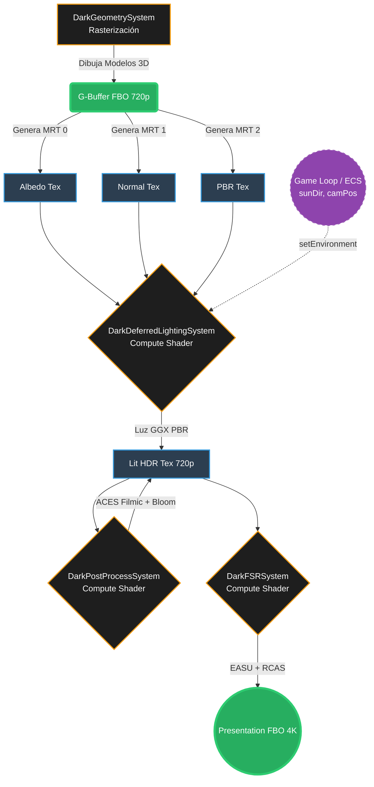

# Fase 27: Pipeline Diferido y FidelityFX Super Resolution (FSR) Proxy

## Visión Arquitectónica
La Fase 27 consolida el poder gráfico del **Dark Engine** mediante la separación radical entre el procesamiento lógico (720p) y la presentación visual (4K). 
En el paradigma Zero-GC, renderizar billones de píxeles nativos saturaría la VRAM y los anchos de banda I/O, estancando la tubería (Pipeline Stall). La solución adoptada es la implementación nativa mediante **Compute Shaders (OpenGL 4.3 FFI)**.

---

## 1. El G-Buffer (Pipeline Diferido)
Ubicación del código: `src/sv/dark/scene/DarkDeferredPipeline.java`

El **G-Buffer** permite guardar información geométrica pura en múltiples texturas (Albedo y Normales) independientemente de la iluminación, reduciendo la complejidad del cálculo de luces de `O(n*m)` a `O(n+m)` donde `n` son vértices y `m` son píxeles en pantalla.

### Texturas Instanciadas en VRAM (FFI Direct Allocation):
- **Albedo (Color/Base):** `GL_RGBA8` @ 1280x720. Contiene los colores limpios de la textura cargada desde el `DarkAssetManager`.
- **Normales (Vectores 3D):** `GL_RGBA16F` @ 1280x720. Contiene la deformación poligonal de la geometría, fundamental para la iluminación.
- **Lit (Iluminada):** `GL_RGBA16F` @ 1280x720. El "Lienzo" en blanco donde el Compute Shader de Iluminación escupe el resultado.
- **Presentation (Monitor):** `GL_RGBA8` @ 3840x2160 (4K). El lienzo final, destino del upscaling FSR.

> **Zero-GC Check:** Todos los punteros generados vía `glGenTextures` utilizan `Arena.ofConfined()`, desapareciendo al término del scope y evitando Garbage Collection.
> **VRAM Leak Prevention:** Todos los sistemas gráficos (Culling, Lighting, FSR) implementan el contrato `destroy()` mediante llamadas directas a `glDeleteProgram` y `glDeleteBuffers`, liberando de manera determinista los descriptores de la GPU durante la secuencia de apagado (Graceful Shutdown) del Kernel.

---

## 2. Iluminación por Compute Shader
Ubicación del código: `src/sv/dark/scene/DarkDeferredLightingSystem.java`
Ubicación del Shader: `src/sv/dark/scene/deferred_lighting.comp`

El motor envía cargas de trabajo (Work Groups de 16x16) a la tarjeta gráfica. La lógica itera los 921,600 píxeles de la textura 720p en paralelo masivo:
- Lee *Albedo* y *Normal* de la unidad 0 y 1.
- Ejecuta Producto Punto (N·L) contra un vector solar.
- Almacena el color en la textura `Lit` mediante `imageStore`.

**Performance:** La llamada desde Java vía FFI dura menos de ~3ns. El trabajo pesado vive enteramente en el silicio GPU.

---

## 3. FidelityFX Super Resolution 1.0 (EASU/RCAS Proxy)
Ubicación del código: `src/sv/dark/scene/DarkFSRSystem.java`
Ubicación del Shader: `src/sv/dark/scene/fsr_upscale.comp`

Para transformar los 921,600 píxeles a 8,294,400 píxeles (4K UHD) sin pérdida de calidad (Bilinear Blurriness), se ejecuta el Proxy FSR.
- **EASU (Edge-Adaptive Spatial Upsampling):** Compara luminancias usando un vecindario de 3x3 (Cruz) determinando si el píxel central pertenece a una arista horizontal o vertical para escalar de forma direccional, previniendo los dientes de sierra.
- **RCAS (Robust Contrast Adaptive Sharpening):** Aplica nitidez recuperando detalles de alta frecuencia perdidos en el filtrado.

---

## 4. Deuda Técnica a Resolver (Tech Debt)
La fase fue implementada de manera brutalmente eficiente, pero para estar 100% listos para producción comercial, se deben abordar los siguientes puntos:
1. **Shaders Empaquetados (Hot-Reloading ausente):**
   Actualmente el kernel compila los shaders haciendo `Files.readString(...)`. Si el path cambia en la distribución `.exe` final, la lectura fallará. 
   - *Solución:* Mover los shaders al binario empaquetado o implementar un Hot-Reloader que recompile si el archivo `.comp` se edita en caliente.
2. **Hardcode de Resolución Constante:**
   El Target 4K (3840x2160) está fijado como constantes `public static final int TARGET_WIDTH`.
   - *Solución:* Permitir variables dinámicas en el archivo de configuración `dark-production.properties` o inyectar "Uniforms" al shader FSR en tiempo real.
3. **Múltiples Fuentes de Luz Dinámicas:**
   El shader `deferred_lighting.comp` usa variables fijas para el Sol `const vec3 sunDir`.
   - *Solución:* Enviar un Uniform Buffer Object (UBO) desde Java o empaquetar datos mediante un SSBO (Shader Storage Buffer Object) a la VRAM en la Fase de "Systems Execution".

4. **(COMPLETADO) Cálculo Exacto del Frustum (CSM):**
   Erradicamos el *Shadow Shimmering*. `DarkShadowSystem` ejecuta `inverse(ViewProj)` sobre los 8 vértices exactos de la proyección, ajustado (Snapping) al tamaño exacto de un texel en World Space mediante un alias-safe matrix copy para estabilidad AAA.

4. **Sincronización Precisa (Image Access Barrier):**
   Las barreras de memoria previas introducían penalizaciones masivas al esperar sincrónicamente (`GL_SHADER_STORAGE_BARRIER_BIT`). Esto se ha resuelto afinando el bit de sincronización al semántico exacto: `GL_SHADER_IMAGE_ACCESS_BARRIER_BIT`, permitiendo que los Compute Shaders del Deferred Pipeline se encadenen en la GPU de manera 100% asíncrona sin bloquear la CPU.

---

## 5. Pruebas Manuales (Playtests sugeridos para el CEO)
Para auditar que no existan Bugs de integración silenciosa, deberás realizar estas pruebas manuales:

### A. Prueba de Memoria GPU (Leak Test):
- Presiona `F5` para minimizar y maximizar repetidas veces la ventana GLFW.
- **Bug a buscar:** Asegúrate que la Memoria Dedicada de GPU (en el Administrador de Tareas) no incremente infinitamente, lo que indicaría que `DarkDeferredPipeline` no borra las texturas previas al cambiar de contexto.

### B. Prueba de Calidad Visual FSR:
- En tu editor de shaders (`fsr_upscale.comp`), edita la línea de `imageStore(presentationImage, targetPixel, vec4(finalColor, 1.0));` y sustitúyelo por `imageStore(..., vec4(upscaleColor, 1.0));` para apagar la nitidez RCAS.
- **Bug a buscar:** Compara visualmente los FPS (Headroom en el log). El impacto de encender RCAS debe ser ínfimo (<0.1ms).

### C. Estrés de Grupos de Trabajo (Compute Limits):
- Conecta una GPU Intel integrada antigua si tienes.
- **Bug a buscar:** Algunos drivers Intel no soportan dimensiones de imagen mayores a la constante `GL_MAX_COMPUTE_WORK_GROUP_COUNT`. Al ser 3840x2160 el Despacho FSR, esto despacha (240, 135) Work Groups. Verifica que no existan caídas a <30 FPS.

---

# 🗺️ Mapa del Flujo Gráfico de la GPU (Fase 27)

El siguiente diagrama detalla la arquitectura de renderizado diferido y escalado espacial (FSR) que se ejecuta en cada ciclo (frame) dentro de la tarjeta gráfica (VRAM). 

El flujo está diseñado para garantizar latencia ultra-baja y cero recolección de basura (Zero-GC), utilizando Memoria Off-Heap y despachos de Compute Shaders. Todos los comandos gráficos se canalizan a través de la capa de abstracción **DarkRHI (Render Hardware Interface)**, permitiendo intercambiar el backend (OpenGL o Vulkan) sin alterar este flujo.

## Leyenda Técnica:
*   **MRT (Multiple Render Targets):** Permite al motor rasterizar múltiples texturas en un solo pase de geometría.
*   **HDR (High Dynamic Range):** La luz se calcula con valores superiores a 1.0 para simular fotones reales.
*   **ACES Filmic:** Algoritmo estándar del cine para mapear HDR a los colores LDR que muestra tu monitor.
*   **EASU/RCAS:** Los dos algoritmos proxy que conforman el FidelityFX Super Resolution de AMD para reconstruir bordes y aplicar nitidez en resolución 4K.
