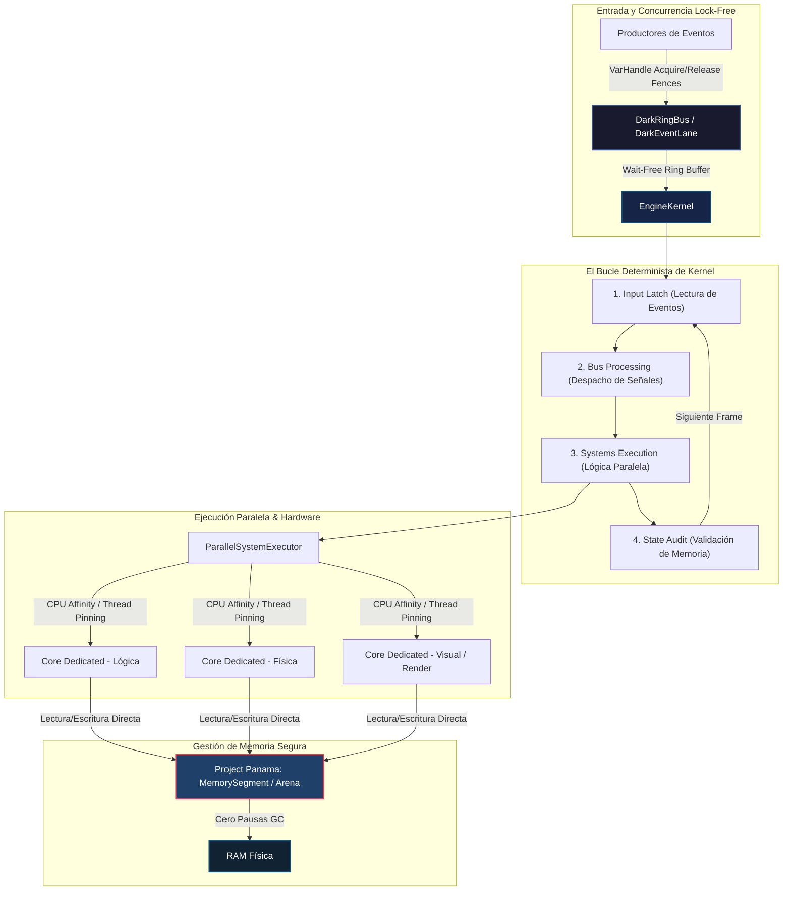

# ¿Por qué DarkEngine? Filosofía de Diseño y Motivación Técnica

## Introducción y Filosofía

Como estudiante autodidacta de arquitectura de sistemas y desarrollo de kernels, siempre me he enfrentado al dogma de que Java es intrínsecamente lento, impredecible y no apto para la programación de bajo nivel o sistemas de tiempo real. Este proyecto nace de la insatisfacción con esa premisa y del deseo de explorar el principio de **Mechanical Sympathy** (empatía con el hardware) bajo la máquina virtual de Java (JVM).

**DarkEngine** no es solo un motor de simulación de alta frecuencia; es una demostración de concepto y un laboratorio experimental para demostrar que, con un diseño microarquitectónico riguroso y aprovechando las características modernas de la JVM (Java 25), es posible construir runtimes de latencia ultrabaja y alto rendimiento sin abandonar la seguridad de memoria de Java, rivalizando directamente con implementaciones tradicionales en C++ o Rust.

---

## El Problema

El desarrollo de runtimes de simulación deterministas y sistemas interactivos de alta frecuencia se enfrenta a tres cuellos de botella fundamentales cuando se ejecutan en entornos administrados tradicionales:

1.  **Pausas del Garbage Collector (GC Latency)**: Los algoritmos estándar de recolección de basura de la JVM introducen pausas impredecibles ("Stop-the-World") que destruyen la consistencia del tiempo de ciclo de simulación de alta frecuencia (por ejemplo, manteniendo un ciclo estable de 60Hz o superior sin jitter).
2.  **Sobrecarga en la Coordinación de Hilos**: El uso de primitivas de sincronización pesadas de nivel de sistema operativo e interrupciones de hilos añade latencias de microsegundos en la comunicación del bus de eventos, limitando el throughput total de datos.
3.  **Ineficiencia del Programador del Sistema Operativo (OS Thread Scheduling)**: La migración aleatoria de hilos críticos entre núcleos de la CPU por parte del sistema operativo destruye la localidad de la caché (L1/L2/L3) e introduce demoras impredecibles en el procesamiento de eventos críticos.
4.  **Desaprovechamiento del Hardware Moderno**: Los lenguajes administrados suelen abstraer los registros vectoriales del procesador, perdiendo la capacidad de realizar operaciones masivas en paralelo (SIMD) de forma nativa sobre el flujo de ejecución principal.

---

## Los Objetivos

Con el diseño de **DarkEngine**, me propuse alcanzar cuatro metas técnicas principales:

*   **Determinismo Temporal Absoluto**: Ejecutar un bucle cerrado en 4 fases (*Input Latch* → *Bus Processing* → *Systems Execution* → *State Audit*) con latencias predecibles en el rango de los nanosegundos.
*   **Eliminación de la Variabilidad de Memoria (Jitter Free)**: Lograr que el hot path del motor funcione de manera indefinida con cero pausas de Garbage Collector, mediante el uso de almacenamiento persistente fuera del montículo (off-heap).
*   **Maximización del Throughput**: Superar los 150 millones de operaciones por segundo en el bus de eventos interactivo empleando algoritmos libres de bloqueos (lock-free).
*   **Control Físico de Recursos**: Obtener afinidad de CPU real a nivel de núcleo de hardware y mapeo directo de memoria en la GPU y la CPU para garantizar que el software se adapte simétricamente a la topología física de la máquina.

---

## Cómo lo Resuelve: La Solución Arquitectónica

Para alcanzar estos objetivos, diseñé e implementé una arquitectura que aprovecha al máximo las capacidades de hardware x86_64 moderno mediante tecnologías emergentes y avanzadas de Java 25:

### 1. Gestión de Memoria Off-Heap (Bypaseando al GC)
Utilizo exclusivamente la **Foreign Memory Access API (Project Panama)** mediante `java.lang.foreign.MemorySegment` y esquemas de asignación basados en `Arena`. Al preasignar buffers de memoria fuera del montículo para el almacenamiento del estado del mundo y la mensajería, el recolector de basura de Java simplemente no tiene objetos que escanear ni liberar en la ruta crítica de ejecución. Esto garantiza un comportamiento 100% libre de pausas del GC (*Zero-GC design*).

### 2. Concurrencia Lock-Free y Barreras de Memoria
El flujo de mensajería inter-hilos se coordina mediante Ring Buffers circulares basados en arquitecturas SPSC (Single Producer Single Consumer) y MPSC (Multi Producer Single Consumer). En lugar de bloqueos de exclusión mutua, la sincronización se realiza mediante operaciones atómicas y barreras de memoria Acquire/Release empleando **VarHandles**. Esto reduce la latencia de comunicación en el bus de eventos a un promedio récord de **23.35 ns**.

### 3. Aceleración Vectorial SIMD Activa
El subsistema de aceleración de datos aprovecha la **Vector API** (`jdk.incubator.vector`). Mediante esta interfaz, el motor detecta y utiliza de forma nativa los registros vectoriales de la CPU (como instrucciones AVX2 de 256 bits o AVX-512 de 512 bits) para realizar cálculos matemáticos complejos sobre múltiples componentes en paralelo en un solo ciclo de instrucción de CPU, alcanzando anchos de banda de procesamiento superiores a **4.17 GB/s**.

### 4. Afinidad de Hardware (Thread Pinning)
Desarrollé una capa de integración con el sistema operativo que, a través de llamadas de sistema nativas de bajo nivel, realiza un binding directo de los hilos del motor a núcleos físicos específicos de la CPU. Esto asegura que el subsistema de despacho de eventos y el kernel del motor nunca sufran migraciones de núcleo por parte del planificador del sistema operativo, maximizando el hit rate en las cachés de instrucciones y de datos L1/L2.

### 5. Validación Rigurosa del Ciclo de Vida
El motor cuenta con un protocolo de inicialización ultra rápida de 0.069 ms y un proceso de apagado coordinado en 6 fases. Durante este apagado, un validador de simetría de bus y un auditor de estado de memoria analizan minuciosamente que cada segmento nativo abierto sea liberado de forma segura, previniendo cualquier fuga de memoria a nivel del sistema operativo.

---

## Conclusión

**DarkEngine** es la prueba física de que la barrera entre el software administrado de alto nivel y el hardware de bajo nivel puede disolverse. Diseñar software con simpatía mecánica permite utilizar la portabilidad y robustez de la JVM sin comprometer el rendimiento microarquitectónico, demostrando que en el desarrollo de software de alto rendimiento, la ingeniería rigurosa y el entendimiento profundo de la CPU siempre superan los mitos y los supuestos tradicionales.

---

## Diagrama de Arquitectura (Flujo de Ejecución y Datos)

El siguiente flujo de arquitectura ilustra cómo interactúan la concurrencia lock-free, el bucle determinista del kernel, la ejecución en núcleos dedicados de la CPU (thread pinning) y la memoria off-heap del Project Panama en **DarkEngine**:

