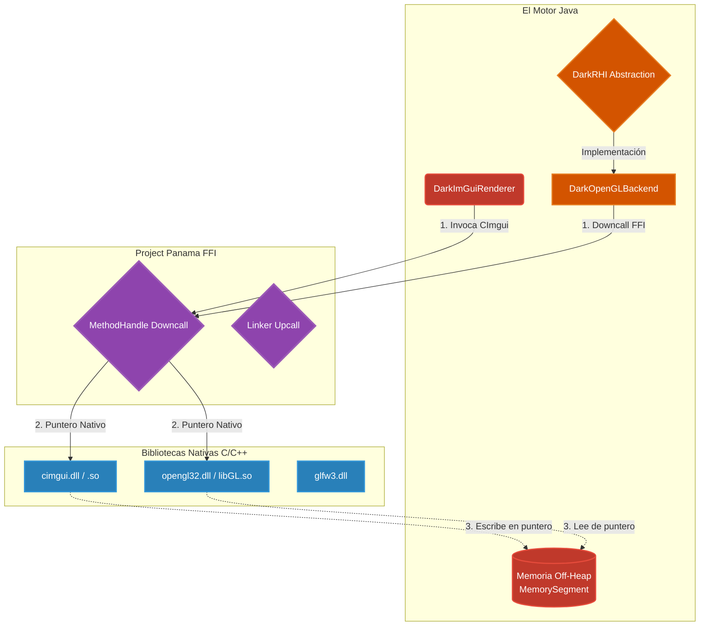

# 🗺️ Mapa del Puente Nativo FFI (Capa 1: Cimientos)

El DarkEngine no utiliza JNI (Java Native Interface) por su masivo costo de rendimiento (latencia en cada llamada a C++). En su lugar, utilizamos el **Foreign Function & Memory API (FFI - Project Panama)**.

Esto permite que nuestro código Java invoque funciones de OpenGL, GLFW y Dear ImGui nativo con la misma velocidad y eficiencia que si estuviéramos programando en C o Rust.

## Leyenda Técnica:
*   **MethodHandle Downcall:** Java compila en tiempo de ejecución (JIT) un acceso directo al código ensamblador de la librería `.dll`, esquivando toda la burocracia de JNI.
*   **Memoria Compartida:** En motores viejos, mandar un arreglo a OpenGL requería duplicar los datos. Aquí, le pasamos a C++ la dirección física exacta de la RAM (`MemorySegment.address()`), logrando una transferencia a costo cero.
*   **DarkRHI (Render Hardware Interface):** (Fase 4.5.0+) Capa de abstracción superior que aísla al motor de la implementación gráfica. Dependiendo del Sistema Operativo, `DarkRHI` delegará dinámicamente al backend (ej. `DarkOpenGLBackend`), logrando *Zero-Coupling*.
*   **Trivialización FFI (Global Audit):** Llamadas pesadas al SO o GPU que pueden sufrir demoras (como `glfwPollEvents` o `glfwSwapBuffers` por V-Sync) están decoradas explícitamente con `Linker.Option.critical(false)`. Esto previene que la JVM congele (Pinning) al Recolector de Basura (GC) nativo, evitando Stalls a nivel de sistema operativo.
