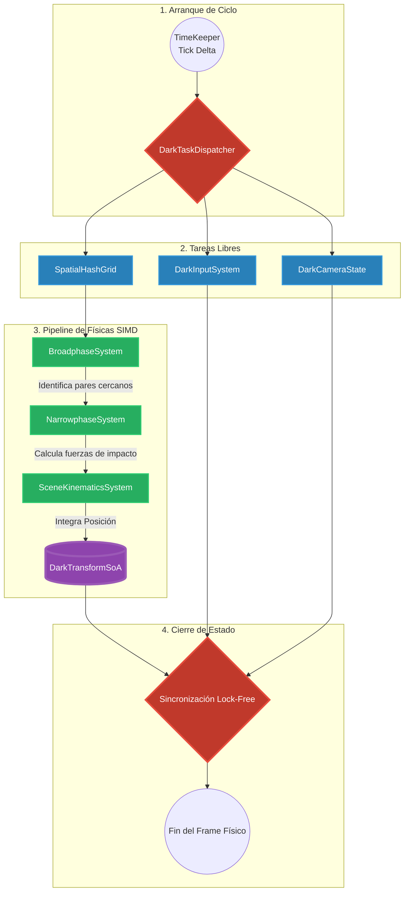

# 🗺️ Mapa del Flujo de Físicas y Orquestación DAG (Fase 4)

Este diagrama documenta la arquitectura de ejecución asíncrona del DarkEngine. El motor no usa barreras globales ni pausas. Utiliza un Grafo Acíclico Dirigido (DAG) para disparar hilos trabajadores (Worker Threads) elásticamente en cuanto sus dependencias de datos (Data-Oriented) son resueltas.

## Leyenda Técnica:
*   **DarkTaskDispatcher:** El "cerebro" multicore. No espera a que terminen todas las tareas para lanzar la siguiente. Si una tarea no depende de otra, la inyecta inmediatamente al Core más libre.
*   **Broadphase (GPU Radix Sort):** Filtra descartes masivos (quién está cerca de quién) procesando miles de colisionadores en paralelo en la VRAM.
*   **Narrowphase (CPU):** Solo se ejecuta cuando el Broadphase termina. Realiza matemática precisa para detectar la profundidad de penetración exacta.
*   **DarkTransformSoA (Struct-of-Arrays):** La memoria final escrita no es un objeto, sino arreglos primitivos crudos (`double[]`) alineados a las líneas de caché de 64 bytes de la CPU.
