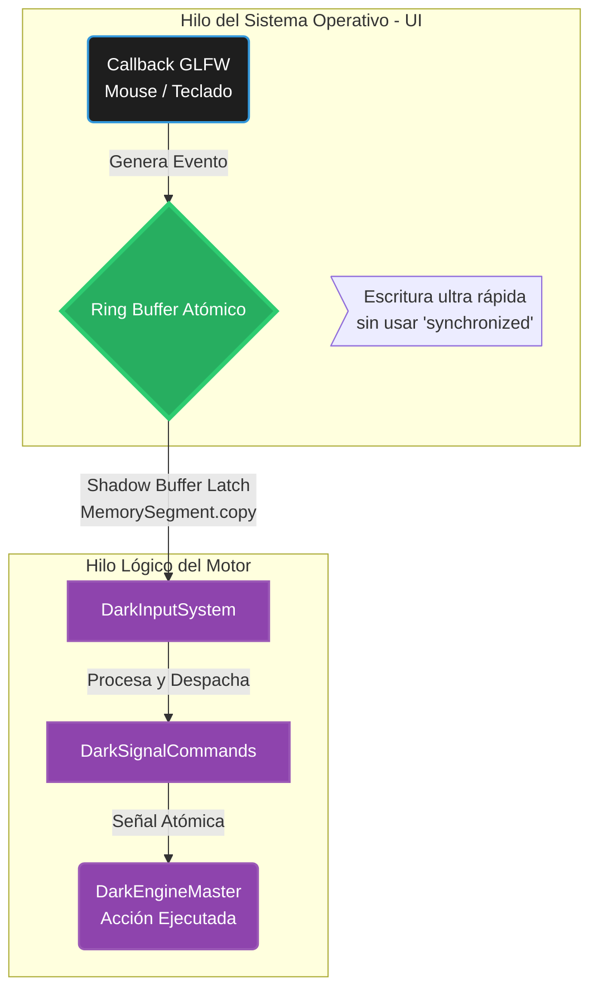

# 🗺️ Mapa del Bus de Entrada Atómico (Capa 2: Orquestación)

Para garantizar que el motor nunca pierda la pulsación de una tecla o un clic del ratón, el sistema de Input debe ser Lock-Free (sin cerrojos). Si el Sistema Operativo (Windows) notifica un evento mientras el motor está procesando físicas, bloquear el hilo principal causaría *stuttering* (tirones).

Por eso, el DarkEngine utiliza un Bus de Señales implementado con operaciones atómicas (`AtomicInteger`, `VarHandle`).

## Leyenda Técnica:
*   **Ring Buffer Atómico (Memory Visibility):** Un arreglo circular en memoria que permite a un hilo escribir (OS) y a otro leer (Motor) al mismo tiempo sin colisionar ni trabarse. Funciona bajo el principio de semántica de memoria *Volatile*. Tras la última auditoría, todo el acceso al arreglo se gestiona explícitamente mediante *Memory Fences* usando `VarHandle.setRelease` y `getAcquire`, aniquilando las condiciones de carrera (Data Races) o lecturas fantasma.
*   **Callback GLFW:** La función en C (FFI) que Windows dispara instantáneamente cada vez que el jugador oprime un botón mecánico en su escritorio.
*   **Shadow Buffer Latch:** El hilo del juego copia masivamente (vía SIMD Vectorizado `MemorySegment.copy`) el estado del buffer directamente a Off-Heap. Evita todo bloqueo (Zero-Contention) contra el Input de GLFW e ImGui.
