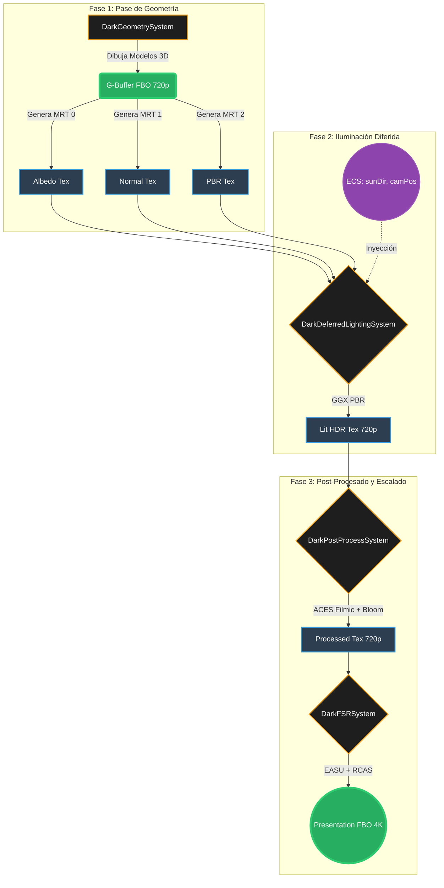

# 🗺️ Mapa del Flujo Gráfico de la GPU (Fase 27)

El siguiente diagrama detalla la arquitectura de renderizado diferido y escalado espacial (FSR) que se ejecuta en cada ciclo (frame) dentro de la tarjeta gráfica (VRAM). 

El flujo está diseñado para garantizar latencia ultra-baja y cero recolección de basura (Zero-GC), utilizando Memoria Off-Heap y despachos de Compute Shaders.

## Leyenda Técnica:
*   **MRT (Multiple Render Targets):** Permite al motor rasterizar múltiples texturas en un solo pase de geometría.
*   **HDR (High Dynamic Range):** La luz se calcula con valores superiores a 1.0 para simular fotones reales.
*   **ACES Filmic:** Algoritmo estándar del cine para mapear HDR a los colores LDR que muestra tu monitor.
*   **EASU/RCAS:** Los dos algoritmos proxy que conforman el FidelityFX Super Resolution de AMD para reconstruir bordes y aplicar nitidez en resolución 4K.
