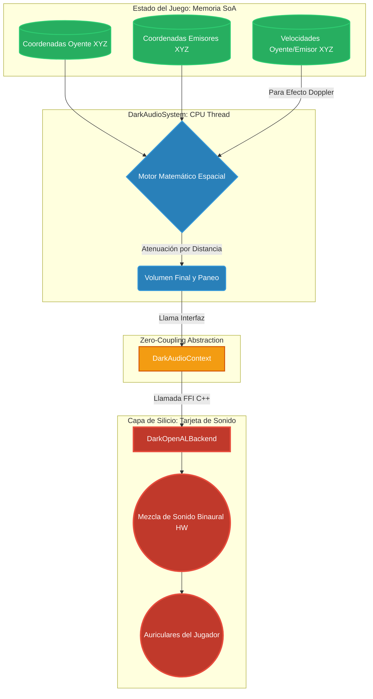

# 🗺️ Mapa del Flujo de Audio Espacial 3D (Capa 3: Magia Sensorial)

El sonido en DarkEngine no es simplemente reproducir pistas estéreo. Cada fuente de sonido (Emisor) y la posición del jugador (Oyente) existen en un espacio 3D matemático. El motor calcula dinámicamente cómo las leyes de la física (Doppler, Distancia) alteran las ondas sonoras antes de llegar a los auriculares del jugador.

## Leyenda Técnica:
*   **Efecto Doppler:** Si un emisor de sonido viaja hacia el jugador, el motor contrae matemáticamente la onda haciendo que suene más aguda. Si se aleja, suena más grave (como una ambulancia en la vida real).
*   **Paneo Espacial (Binaural):** Si el sonido ocurre a la derecha, la tarjeta de sonido procesa un micro-retraso para que llegue primero al audífono derecho simulando cómo funciona la audición humana.
*   **Atenuación Logarítmica:** El sonido pierde fuerza exponencialmente según el inverso del cuadrado de la distancia, procesado a través de las primitivas de ECS.
*   **DarkAudioContext (Zero-Coupling):** Desacopla la lógica matemática del backend nativo. Permite intercambiar `DarkOpenALBackend` por XAudio2 sin tocar el Hot-Path.
*   **Hardware Sympathy (Destrucción):** Durante el `Graceful Shutdown`, el backend nativo purga proactivamente las fuentes (`alDeleteSources` vía FFI) antes de destruir el contexto para evitar un **Underflow** en el anillo del hardware de audio del Sistema Operativo (`audiodg.exe`), preservando los C-States de la CPU.
