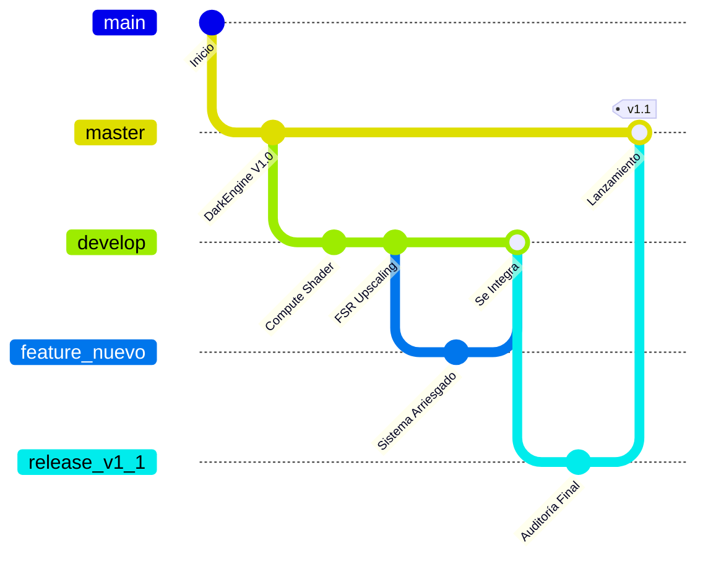

# 🎓 Masterclass: Arquitectura de Ramas en GitHub (GitFlow)

Para entender GitHub, no debes pensar en él como una carpeta donde guardas archivos, sino como un **árbol de líneas de tiempo alternativas**.

La metodología estándar de la industria (que usan empresas como Google o Microsoft) se llama **GitFlow**, y se basa en tres pilares principales: `master`, `develop` y las ramas `feature/`.

---

## 1. La Trinidad de las Ramas

### 👑 `master` (o `main`) — Producción Inmaculada
Es el código sagrado. **NUNCA se programa directamente en `master`**. 
Lo que hay aquí es lo que descarga el cliente final. Solo acepta código que ha sido testeado, auditado y compilado con éxito. Si tu motor funciona perfecto, es gracias a que `master` está limpio.

### 🛠️ `develop` (o `dev`) — La Fábrica (Tu área de trabajo principal)
Es la rama donde se unen todas las nuevas funcionalidades antes de lanzarlas al público.
Aquí es donde ocurre la inestabilidad controlada. Si el motor crashea o la VRAM se desborda, no pasa nada porque estamos en `develop`. Una vez que `develop` es estable, se "fusiona" (hace *Merge*) hacia `master`.

### 🚀 `release/*` — El Puente de Empaquetado
Esta rama se crea **solamente** cuando vas a lanzar una versión oficial (Ej. `release/v1.0`).
Aquí no se añaden features nuevas, solo se corrigen bugs de última hora, se actualiza el `README` y se corre el empaquetado `.bat`. Una vez empaquetado, esta rama se envía a `master` y muere (o se queda de referencia).

---

## 2. El Flujo de Trabajo Perfecto para DarkEngine

Ahora que hemos purgado el repositorio, tu flujo de vida debería verse exactamente así:

## 3. ¿Qué Acabamos de Hacer? (Limpieza Profunda)

Tal como sugeriste en tu nota de voz, tu instinto fue completamente acertado: el nombre `phase27-deferred-pipeline-fsr` era demasiado largo y ya abarcaba demasiado como para ser solo una "fase". 

He ejecutado los siguientes comandos en tu servidor remoto:

1. **Renombrado a `develop`:** Tomé la rama de la fase 27 y la bauticé oficialmente como tu rama `develop`. Ahora todo tu trabajo diario ocurrirá aquí.
2. **Purga de Zombis:** Eliminé las 10 ramas muertas (`phase19`, `phase21`, `graceful-shutdown`, etc.) tanto de tu PC local como de los servidores de GitHub.
3. **Muerte de `release/v1.0`:** (Opcional) Aún existe, pero ya no la usaremos porque ya cumplió su propósito alimentando a `master`.

## Resumen de tu Repositorio HOY
Si entras a tu GitHub, solo verás tres cosas:
- **`master`**: El motor V1.0 AAA+ que empaquetamos.
- **`develop`**: Tu código actual donde harás el FSR.
- **`release/v1.0`**: El vestigio de nuestra última auditoría.
